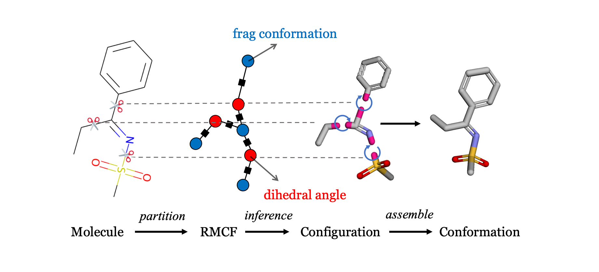
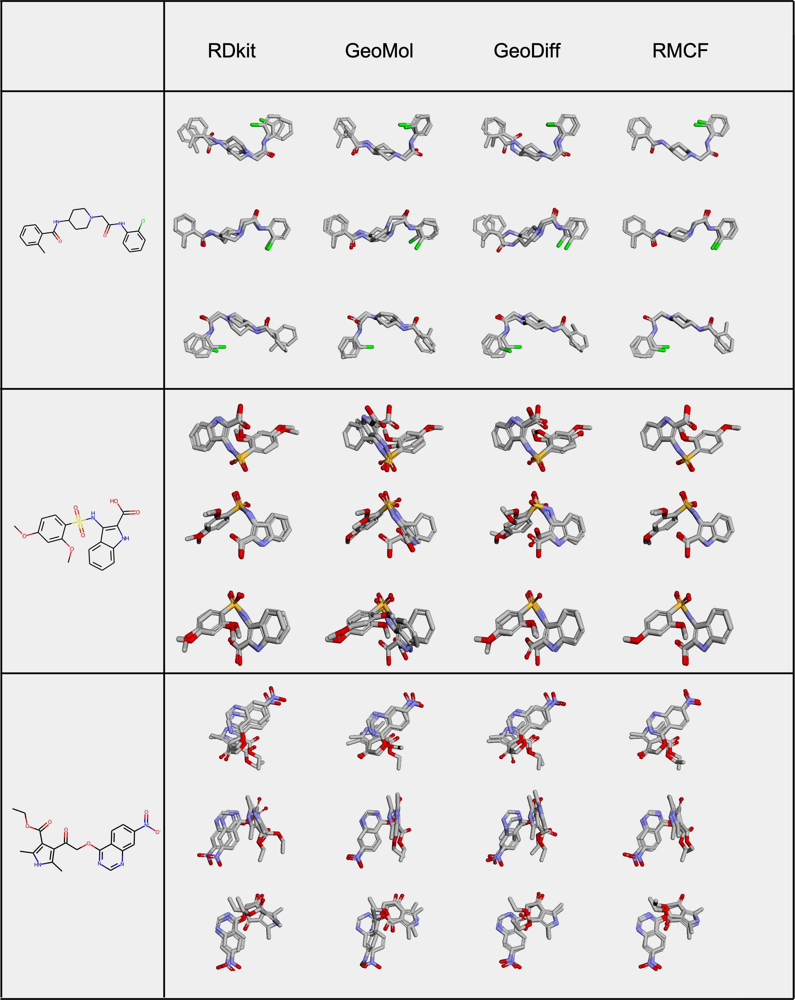

# Regularized Molecular Conformation Fields


## [Paper Link](https://openreview.net/pdf?id=7XCFxnG8nGS)


Implementation of RMCF(NeurIPS2022), method for molecular conformation generation, by Lihao Wang, Yi Zhou, Yiqun Wang, Xiaoqing Zheng, Xuanjing Huang, Hao Zhou.
This repository contains all code to reproduce a model. 
If you have any question, feel free to open an issue or reach out to us: [wanglh19@fudan.edu.cn](wanglh19@fudan.edu.cn).
<p align="center">
   
</p>

## Requirements

* torch (=1.12.0)
* rdkit (>=2022.9.3)
* networkx (>=2.6.3)
* transformers (=4.9.1)
* scikit-learn (>=1.0.2)
* scikit-learn-extra (>=0.2.0)
* torch-scatter (>=2.1.0)
* torch-sparse (>=0.6.16)
* torch-cluster (>=1.6.0)
* torch-spline-conv (>=1.2.1)
* torch-geometric (>=2.2.0)
* debugpy (>=1.6.5)
* fairscale (>=0.4.6)
* einops (>=0.6.0)
```bash
pip install -r requirements.txt
```
## Dataset
The offical raw GEOM dataset is avaiable [[here]](https://dataverse.harvard.edu/dataset.xhtml?persistentId=doi:10.7910/DVN/JNGTDF). Please download and unzip the dataset, such that you have the path `rdkit_folder/`
## Preprocessing
### 1. Generate Vocabulary(Optional)

```bash
python3 data_gen/step0_gen_vocab.py
```
We provide generated vocabularies in `geom-drugs/`
### 2. Process  Molecules
```bash
python3 data_gen/step1_process_mol.py
```
### 3. Split Dataset
```bash
python3 data_gen/step2_split_data.py
```
The training set is cut into `8` (8 GPUs) parts by default.
## Training
You can train the model with the following commands:
```bash
python3 train.py \
    --train-prefix  $data_path/train \
    --valid-prefix  $data_path/valid \
    --test-prefix   $data_path/test \
    --model-dir $model_dir \
    --seg-vocab-path $data_path/hit.pkl \
    --vocab-path $data_path/vocab.pkl \
    --model-name rmcf \
    --mpnn-steps 3 \
    --batch-size 256 \
    --learning-rate 5e-4
```
or
```bash
bash scripts/train.sh
```
## Evaluation & Generation
the `COV` and `MAT` scores on the GEOM-Drugs testset can be calculated using the following commands:
```bash
python3 generate.py \
    --test-prefix  $data_path/test \
    --model-dir $model_dir \
    --seg-vocab-path $data_path/hit.pkl \
    --vocab-path $data_path/vocab.pkl \
    --sampling-strategy random \
    --cov-thres 1.25 \
    --model-name rmcf \
    --mpnn-steps 3 \
    --batch-size 256 
```

or
```bash
bash scripts/test.sh
```
If want to get predicted molecules, please add an argument `--return-mols`
## Examples
<p align="center">
   
</p>

